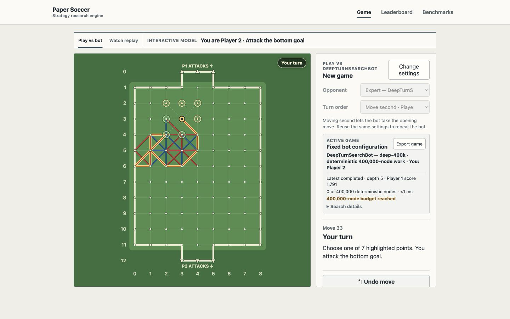
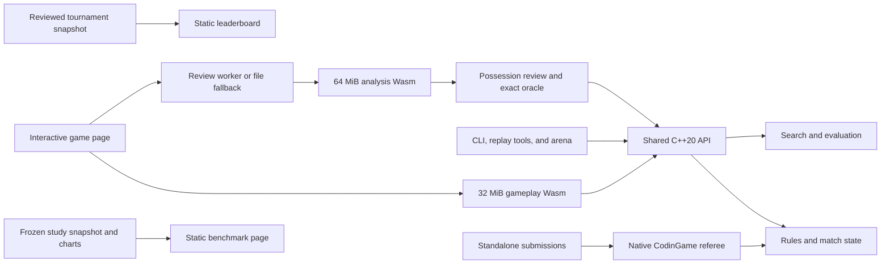

# Paper Soccer Strategy Engine

A deterministic C++20 and WebAssembly engine for playing, analyzing, and
benchmarking paper-soccer strategies. The repository records a CodinGame
submission that finished **4th of 208** and, separately, a preregistered
**4,800-game** study under the browser demo rules.

[](https://github.com/Lecorbio/paper-soccer-strategy-engine/actions/workflows/pages.yml)
[](LICENSE)

**[Play the live demo](https://lecorbio.github.io/paper-soccer-strategy-engine/)**
· **[View the bot leaderboard](https://lecorbio.github.io/paper-soccer-strategy-engine/leaderboard/)**
· **[Explore the benchmark](https://lecorbio.github.io/paper-soccer-strategy-engine/benchmarks/)**
· [Read the frozen study](benchmarks/flagship_study/REPORT.md)

## At a glance

- **[4/208 on CodinGame](submissions/codingame/bots/rank_4/README.md):**
  history version 56 completed a 66–24 arena batch with score `44.29750553418035`.
- **[4,800 decisive study games](benchmarks/flagship_study/REPORT.md):**
  2,400 color-swapped opening pairs, disjoint selection/test data, and zero
  truncations.
- **[Accepted local large-teacher candidate](benchmarks/large_teacher_campaign/REPORT.md):**
  four 1,000-game strength panels passed with zero illegal or unfinished games,
  followed by a 981.945875 ms uncontended maximum under the strict 1,000 ms gate.
- **[Possession-aware Game Review](docs/demo-and-replays.md#review-a-finished-game):**
  complete-turn recommendations, exact late-game proofs, grading, replay
  export, and reversible “Try this line” analysis.
- **[22-bot local leaderboard](benchmarks/codingame_leaderboard/README.md):**
  990 protocol-faithful games across all checked-in generated CodinGame
  submissions.



## What the project contains

- One authoritative rules engine for legality, rebounds, terminal states,
  match history, native tools, and both browser Wasm boundaries.
- Seeded MCTS, possession-aware alpha-beta, neural evaluation, complete-turn
  search, transposition tables, and a bounded exact endgame solver.
- A static browser application for human play, bot replays, diagnostics,
  imports/exports, and post-game analysis without a backend.
- Reproducible arenas, opening banks, model pipelines, standalone CodinGame
  submissions, frozen reports, and explicit negative experiment results.

## Ranked artifacts and demo adapters

The contest results and browser opponents are related, but they are not the
same executable or rules contract.

| Name | Role | Recorded evidence |
| --- | --- | --- |
| [`rank_4`](submissions/codingame/bots/rank_4/README.md) | Canonical current local snapshot associated with the platform result | Version 56; rank 4/208; 66–24 |
| [`rank_5`](submissions/codingame/bots/rank_5/README.md) | Immutable historical predecessor | Version 26; rank 5/206; 57–33 |
| `Rank5DerivedBot` | Fixed 50,000-node adaptation of `rank_5` search to the demo rules | Demo-only gates and Wasm measurements; no inherited platform rank |

`rank_4` is a standalone CodinGame submission, not a browser `BotKind`.
`Rank5DerivedBot` remains intentionally tied to the historical `rank_5` source
because the frozen studies and Game Review calibration identify that exact
comparator.

## Game Review

The browser groups physical rebound edges into possessions, compares each
played action with a complete recommended action, marks the first divergence,
and lets the user explore a separate C++-validated continuation. Fast preview
uses the deterministic `fast-50k` profile. The completed gate selected
`deep-400k`, enabled **Expert — DeepTurnSearch**, and recorded 67.25% against
fixed Rank5Derived and 61.38% against JacekInspired over 1,600 held-out games.

Possession-boundary positions with at most 18 reachable unused edges can be
solved exactly within the 250,000-node oracle budget. Other grades are
deterministic estimates tied to the named search profile and calibration, not
claims of objective move truth. See
[Demo, CLI, and replays](docs/demo-and-replays.md) for the full workflow and
export contract.

## Architecture



JavaScript schedules commands and renders complete snapshots; C++ owns game
state and decisions. The static results pages never execute submitted bots.
See the [full architecture](docs/architecture.md) and
[algorithm notes](docs/algorithms.md).

## Quick start

The normal build requires CMake 3.20+, a C++20 compiler, Node.js 18+, Python 3,
and Chrome or Chromium for the full browser smoke suite.

```bash
./scripts/build-and-test.sh
./build/native/papersoccer_cli
```

The script configures a Release build in `build/native`, compiles the native
tools and standalone submissions, checks generated source/model artifacts, and
runs CTest. Rebuilding and byte-checking the checked-in Wasm modules additionally
requires the pinned Emscripten 6.0.2 toolchain; see
[Reproducibility](docs/reproducibility.md#webassembly-artifacts).

The checked-in single-file Wasm modules also let the browser app run directly.
On macOS:

```bash
open web/index.html
```

On other systems, open `web/index.html` in a modern browser.

## Documentation

- [Demo, CLI, Game Review, and replays](docs/demo-and-replays.md)
- [Rules and algorithms](docs/algorithms.md)
- [Architecture](docs/architecture.md)
- [Experiments and benchmark evidence](docs/experiments.md)
- [Reproducibility and artifact checks](docs/reproducibility.md)
- [CodinGame submission archive](submissions/codingame/README.md)
- [Model artifacts and provenance](models/README.md)
- [Offline Jacek replay BFM](docs/jacek-replay-bfm.md)
- [Compact value-BFM challenger](docs/compact-value-bfm.md)
- [Rank-4 teacher-distillation campaign](docs/compact-value-bfm-rank4-teacher-challenger.md)
- [Large-teacher self-search outcome](benchmarks/large_teacher_campaign/REPORT.md)

## License

Owner-authored source and documentation are available under the
[MIT License](LICENSE). See [NOTICE](NOTICE.md) for attribution and the status
of generated or external material.
