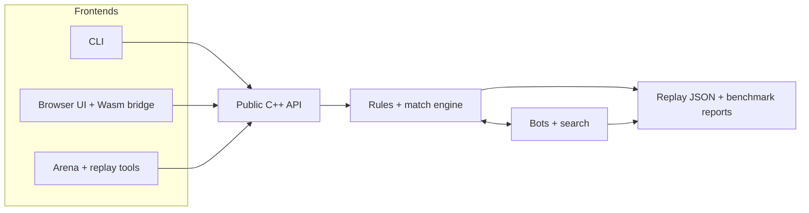

# Paper Soccer Strategy Engine

A deterministic C++20 game-AI platform that turns a **rank 5 of 206** CodinGame result into an inspectable engine, search laboratory, replay pipeline, and WebAssembly demo.

[](https://github.com/Lecorbio/paper-soccer-strategy-engine/actions/workflows/pages.yml)
[](LICENSE)
[](https://lecorbio.github.io/paper-soccer-strategy-engine/)

## Verified competitive result

The preserved CodinGame entrant is verified at **5th out of 206**, scoring
`42.42773147296124` in arena history version 26. Its generated 93,005-character
submission is reproducible byte for byte at SHA-256
`f29959c4b6db6225de4e3913ee1eb020c7adf4e5363cabff545bfa275d0dce29`.

### [▶ Try the live browser demo](https://lecorbio.github.io/paper-soccer-strategy-engine/)

Play against deterministic search bots, inspect their diagnostics, undo moves,
or generate and replay bot-vs-bot games. The static app runs the shared C++
rules and bot layer through a checked-in WebAssembly module.

| Quantified highlight | Verified result | Evidence |
| --- | --- | --- |
| Authentic CodinGame submission | **Rank 5/206**, score **42.42773147296124** | [Incumbent record](submissions/codingame/bots/rank_5/README.md) |
| Tactical MCTS promotion gate | **389–11 across 400 games** (97.25%); paired 95% interval 95.5%–98.75% | [Experiment record](docs/experiments.md#tactical-mcts-promotion) |
| Rank5Derived WebAssembly profile | **42.56 ms median / 50.31 ms p95** over 80 fresh complete-turn searches | [Curated benchmark](benchmarks/rank5_derived/wasm_result.json) |

The MCTS result compares the maintained demo engine with its older Uniform,
non-reusing reference. The WebAssembly timing is machine-specific (Apple M4
Pro) and belongs to the adapted demo profile. Neither is a measurement of the
original ranked submission.


## Build and test in one command

Prerequisites: CMake 3.20+, a C++20 compiler, and Node.js 18+. Python 3 is
used for generated-model freshness checks when available.

```bash
./scripts/build-and-test.sh
```

That command configures a Release build, compiles every native target, and runs
the complete registered CTest suite. CI invokes the same entrypoint with GCC,
Clang, and Clang ASan/UBSan configurations.

Useful overrides stay explicit:

```bash
CXX=clang++ PAPERSOCCER_BUILD_DIR=build/clang ./scripts/build-and-test.sh
PAPERSOCCER_ENABLE_SANITIZERS=ON \
  PAPERSOCCER_BUILD_DIR=build/sanitizers ./scripts/build-and-test.sh
```

See [reproducibility](docs/reproducibility.md) for pinned research dependencies,
WebAssembly verification, artifact hashes, and clean-environment commands.

## What makes it interesting

- **One authoritative rules engine.** CLI play, bots, replay export, arena
  reports, and browser sessions share the same public C++ state transitions.
- **Possession-aware adversarial search.** Rebounds keep the same player on
  move, so alpha-beta and complete-turn search advance depth on handoff rather
  than on every physical edge.
- **Deterministic engineering.** Fixed seeds, fixed work budgets, incremental
  hashing, make/unmake search positions, transposition tables, and artifact
  checks make failures and comparisons reproducible.
- **Several search perspectives.** The engine includes seeded random play,
  MCTS with solver propagation, iterative-deepening alpha-beta, a compact
  neural leaf evaluator, and the separately identified rank-5-derived adapter.
- **Evidence with limits.** Curated reports retain configurations, paired color
  swaps, confidence intervals, legality checks, and rejected experiments—not
  just favorable headline numbers.

## Architecture



See [architecture and data flow](docs/architecture.md) for component boundaries,
state ownership, and the native/WebAssembly split.

## Ranked artifact vs. demo adaptation

| | Authentic `rank_5` submission | `Rank5DerivedBot` |
| --- | --- | --- |
| Purpose | Preserved CodinGame contest entrant | Interactive demo opponent |
| Rules | CodinGame goal and blocking contract | Standard 8×10 demo contract |
| Budget | Contest clock | Deterministic 50,000 visited nodes |
| Evaluation | Hand-written + replay-trained blend and exact-history replay book | Search-only; 0% learned blend and no replay corrections |
| Claim | Verified rank 5/206 | Adapted engineering demo; no contest-rank claim |

The maintained rank-5 source is included through a private no-main adapter.
`Rank5DerivedBot` reuses its complete-turn search, caches rebound continuations,
and invalidates them whenever the supplied game state diverges. It deliberately
does not enter contest timing or replay-correction paths.

## Algorithms at a glance

**Alpha-beta** uses iterative deepening, possession-handoff depth, exact
terminal scores, move ordering, compact incremental keys, and bounded
transposition storage. A soft physical-ply horizon evaluates branches with
choices while still following forced lines.

**MCTS** uses UCT selection, deterministic seeding, tactical rollouts, optional
tree reuse, a hard node bound, and solver propagation for proven winners.
Experimental tactical quiescence remains opt-in because its recorded strength
gate failed.

**JacekInspiredBot** combines the alpha-beta framework with an independently
trained `1156 → 32 → 32 → 1` value network. Its standard-board contract,
checkpoint hashes, held-out metrics, and modest paired gates are documented;
it is not a copy of another contestant's unpublished bot or weights.

Read [algorithms and search decisions](docs/algorithms.md) for configurations,
public API examples, diagnostics, and failure-safe behavior.

## Run the project

```bash
./build/native/papersoccer_cli
open web/index.html
mkdir -p results
./build/native/papersoccer_replay_export 12345 512 > results/replay.json
```

The browser app needs no server. It supports human-vs-bot play, bot-vs-bot
replay generation, JSON import/export, search diagnostics, and move undo.
Details and replay schemas are in [demo and replays](docs/demo-and-replays.md).

The native arena writes stable JSON for paired matches and shared-position
measurements. Raw local runs belong in ignored `results/`; compact reviewed
reports that support repository claims remain tracked in `benchmarks/`.
See [experiments](docs/experiments.md) for methodology, historical outcomes,
reproduction commands, and explicit limitations.

## Repository guide

| Path | Role |
| --- | --- |
| [`include/papersoccer`](include/papersoccer) | Stable public C++ API |
| [`src/core`](src/core) | Geometry, legal moves, match state, and rendering |
| [`src/bots`](src/bots) | Random, MCTS, alpha-beta, neural, and derived search |
| [`src/arena`](src/arena) | Paired experiments and stable JSON reporting |
| [`web`](web) | Static accessible UI and generated single-file Wasm module |
| [`tests`](tests) | Native, submission, arena, replay, JavaScript, and Wasm checks |
| [`submissions/codingame`](submissions/codingame) | Maintained and generated contest artifacts with provenance |
| [`models`](models) | Compact model, feature contract, hashes, and training record |
| [`benchmarks`](benchmarks) | Curated reproducible benchmark summaries and probes |

Deeper documentation:

- [Architecture](docs/architecture.md)
- [Algorithms](docs/algorithms.md)
- [Demo and replays](docs/demo-and-replays.md)
- [Experiments](docs/experiments.md)
- [Reproducibility](docs/reproducibility.md)
- [CodinGame artifact history](submissions/codingame/README.md)
- [Neural model card](models/README.md)

## Scope and limitations

Paper soccer benchmarks are paired and deterministic, but small samples and
machine timings are identified as such. The full competitive tournaments are
not part of normal tests. No new tournament was run for this presentation
rewrite, and `Rank5DerivedBot` is intentionally excluded from the native arena.

## License and attribution

Owner-authored source and documentation are available under the [MIT License](LICENSE).
Generated files inherit the status of their inputs. External names, trademarks,
public replay facts, and linked material are not relicensed; see [NOTICE](NOTICE.md)
for scope and the attribution to Jacek Dermont's published input representation.
