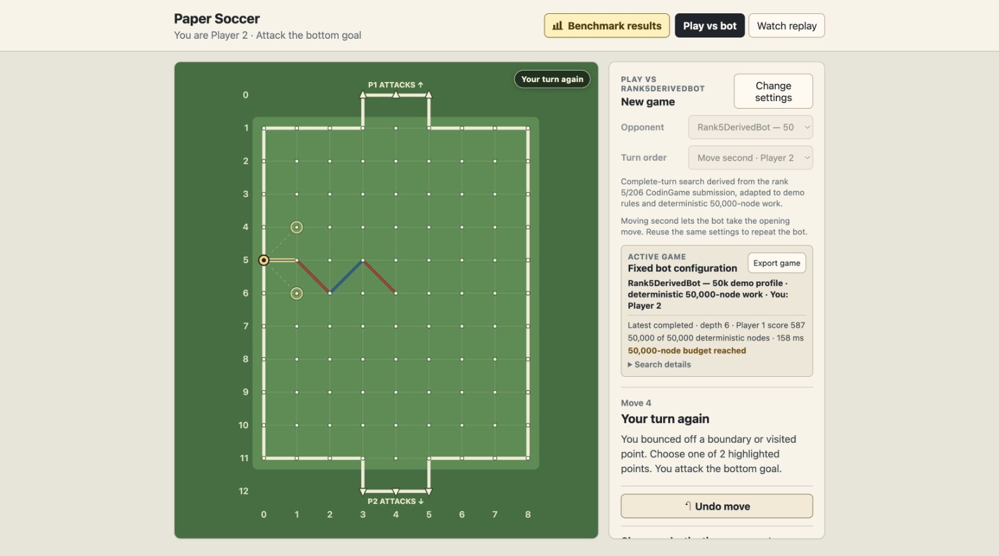
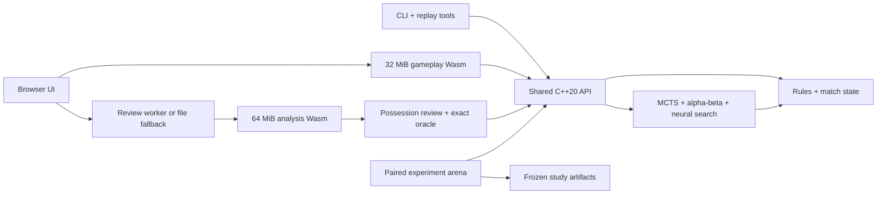

# Paper Soccer Strategy Engine

A deterministic C++20/WebAssembly game-AI engine whose authentic CodinGame submission ranked **5th of 206**, backed by a preregistered **4,800-game** evaluation.

[](https://github.com/Lecorbio/paper-soccer-strategy-engine/actions/workflows/pages.yml)
[](LICENSE)

**[Play the live demo](https://lecorbio.github.io/paper-soccer-strategy-engine/)**
· **[Explore the benchmark](https://lecorbio.github.io/paper-soccer-strategy-engine/benchmarks/)**
· **[Track the native bot](https://lecorbio.github.io/paper-soccer-strategy-engine/jacek-native/)**
· [Read the frozen study](benchmarks/flagship_study/REPORT.md)

- **[5/206](submissions/codingame/bots/rank_5/README.md):** verified authentic CodinGame result, tied to an immutable generated submission and SHA-256.
- **[4,800 decisive test games](benchmarks/flagship_study/REPORT.md#frozen-test-results):** 2,400 color-swapped opening pairs with zero truncations.
- **[60.4% neural-versus-hand score](benchmarks/flagship_study/REPORT.md#pairwise-results):** 95% CI 57.4%–63.5%; the selected neural profile measured **[35.7 ms validation p95](benchmarks/flagship_study/REPORT.md#development-and-validation-findings)** on the study machine.
- **Possession-aware Game Review:** grades a player's complete rebound action,
  keeps every edge selectable, and separates exact endgames from deterministic
  engine estimates.

> **Provenance matters:** `rank_5` is the authentic ranked CodinGame artifact. `Rank5DerivedBot` adapts its search code to different demo rules and a fixed 50,000-node profile; demo measurements do not evaluate the ranked submission.

[](https://lecorbio.github.io/paper-soccer-strategy-engine/)

## Possession-aware Game Review

After a completed live game, generated bot replay, or valid imported replay,
select **Review game** for a chess-review-style analysis adapted to paper
soccer's rebound rules. A timeline badge represents one possession, while the
normal replay controls still select every physical edge. The board draws the
played and recommended complete-turn paths separately and marks their first
divergence. **Try this line** creates an authoritative C++ fork at that
boundary and shows the C++-validated recommendation as a ghost path. The user
can follow or deviate from it by choosing legal edges, then continue for either
side without changing the source replay.

**Fast preview** uses the fixed `fast-50k` profile: depth 32, 50,000 nodes,
65,536 transposition entries, 32,768 evaluation entries, no clock, no replay
corrections, and no learned-value blend. **Deep refinement** first produces the
Fast result, then reruns each possession with the independently selected and
validation-calibrated `deep-100k`, `deep-200k`, or `deep-400k` profile. Both
modes are deterministic for the same replay and build.

At a possession boundary with no more than 18 reachable unused edges, a
250,000-node exact solver can prove the winner and distance. Otherwise labels
such as Good or Mistake are profile-specific deterministic engine estimates,
not objective truth or per-move confidence intervals. The summary reports
grade counts, best-action rate, and largest estimated loss; it deliberately
does not invent an overall accuracy score or win-probability graph. Game Review
is post-game only and never supplies live hints. Its versioned export preserves
the unchanged source replay and SHA-256 plus profile, calibration, oracle,
ranked-source, action, divergence, proof, grade, confidence-state, and
deterministic diagnostic identities; wall-clock timings are omitted.

The playable **Expert — DeepTurnSearch** label is a separate, conditional
claim. It is shown only if the frozen held-out test gives a paired 95% lower
confidence bound above 50% against both the fixed Rank5Derived 50k profile and
the selected JacekInspired 20k profile. Deep Game Review ships even when that
strength gate is unresolved. See [Experiments](docs/experiments.md#game-review-strength-calibration-and-expert-gate).

## Why this project?

Paper soccer is a compact adversarial game in which rebounds can extend one possession across several edges. That makes a conventional edge-by-edge search horizon misleading: the engine instead searches complete turns, while deterministic work budgets make bot comparisons replayable.

One authoritative rules model powers native play, WebAssembly, replay tooling,
Game Review, and the experiment arena. The project combines MCTS,
possession-aware alpha-beta, complete-turn analysis, exact endgame search,
hand-crafted and neural evaluation, compact make/unmake state, diagnostics, and
frozen statistical evidence.

## Architecture



C++ owns move legality, rebounds, terminal detection, bot state, and replay history. JavaScript only schedules commands and renders complete snapshots. See the [full architecture](docs/architecture.md) and [algorithm notes](docs/algorithms.md).

## Evaluation design

The flagship study compared four competitive demo-rule entrants: tactical MCTS, hand-evaluated alpha-beta, neural alpha-beta, and the fixed Rank5Derived profile. It froze disjoint development, validation, and test openings before test evaluation; played both colors from every opening; selected configurations under a 50 ms validation-p95 gate; and resampled whole opening pairs 10,000 times.

The strongest supported head-to-head finding was neural alpha-beta over hand alpha-beta. Neural alpha-beta versus Rank5Derived remained statistically unresolved at 51.4% with a 95% CI of 48.2%–54.5%—a negative result reported rather than tuned away. The [manifest](benchmarks/flagship_study/manifest.json), [selection lock](benchmarks/flagship_study/selection_lock.json), [curated data](benchmarks/flagship_study/data/test.json), and [report](benchmarks/flagship_study/REPORT.md) are checked in.

Game Review has a separate frozen gate and fresh opening banks at 4, 8, 12,
and 20 physical plies. That gate selects and calibrates the Deep profile before
one held-out 1,600-game test; it does not alter or reinterpret the flagship
study. Its design and reproduction commands are documented in
[Experiments](docs/experiments.md#game-review-strength-calibration-and-expert-gate)
and [Reproducibility](docs/reproducibility.md#game-review-gate).

## Build and test

Requires CMake 3.20+, a C++20 compiler, Node.js 18+, and Python 3.

```bash
./scripts/build-and-test.sh
```

This creates a Release build in `build/native`, compiles the native tools, verifies generated artifacts, and runs the registered tests. Then launch the terminal game with `./build/native/papersoccer_cli`.

## Documentation

- [Demo, CLI, and replays](docs/demo-and-replays.md)
- [Rules and algorithms](docs/algorithms.md)
- [Architecture](docs/architecture.md)
- [Experiments and benchmark evidence](docs/experiments.md)
- [Reproducibility and artifact hashes](docs/reproducibility.md)
- [CodinGame submission archive](submissions/codingame/README.md)
- [Neural model card](models/README.md)

## License

Owner-authored source and documentation are available under the [MIT License](LICENSE). See [NOTICE](NOTICE.md) for attribution and the status of generated or external material.
