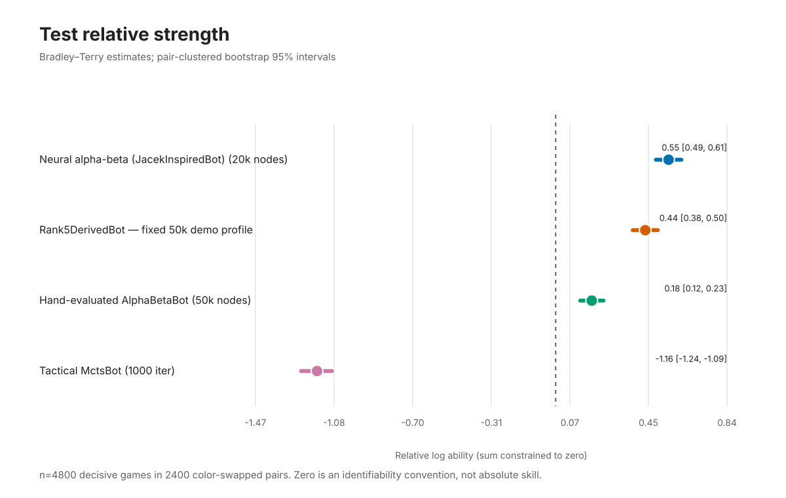
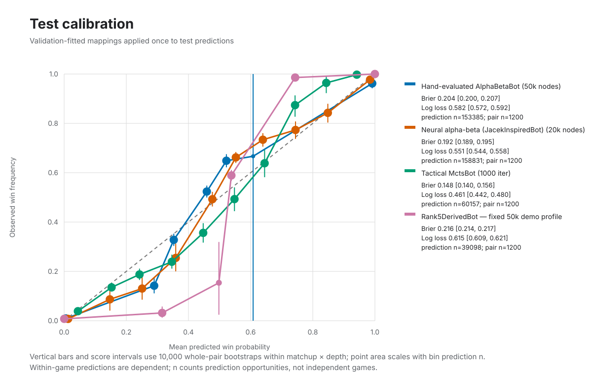
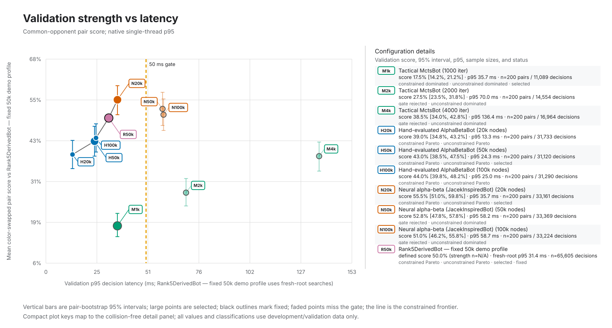

# Competitive demo-rule Paper Soccer bot study

## Executive abstract

This study asks which of four competitive demo-rule bots is strongest, best calibrated, and most efficient under a 50 ms validation p95 decision-latency constraint. It froze disjoint development, validation, and test opening banks; selected bot profiles and fitted calibration mappings on validation only; and then evaluated the locked entrants once on 4,800 decisive test games (2,400 color-swapped pairs, zero truncations).

Neural alpha-beta scored 60.4% against hand alpha-beta (pair-clustered 95% CI 57.4%–63.5%), supporting the conclusion that Neural alpha-beta is stronger; its selected profile measured 35.718 ms validation p95. Neural alpha-beta scored 51.4% against Rank5DerivedBot — fixed 50k demo profile (pair-clustered 95% CI 48.2%–54.5%), so the comparison remains statistically unresolved. Results are limited to these frozen openings, demo rules, entrants, and gate machine; calibration decisions within games are dependent, and Rank5DerivedBot is not the authentic ranked submission.

## Research question and hypotheses

**Question.** Under standard 8×10 demo rules, which of the four competitive entrants has the strongest frozen test performance, the best calibrated predictions, and the most favorable validation strength/latency tradeoff?

The preregistered hypotheses were:

- Additional fixed computation may improve paired strength, with a measurable latency cost.
- Hand-crafted and neural alpha-beta evaluation may differ in both strength and calibration at equal node budgets.
- The fixed Rank5DerivedBot — fixed 50k demo profile may fall on or off the constrained validation frontier without any profile tuning.

## Entrants

- **Tactical MctsBot.** Tactical rollouts, rollout-only leaves, deterministic tree reuse, and the frozen iteration sweep.
- **Hand-evaluated AlphaBetaBot.** Depth-six possession search with the hand evaluator and fixed node budgets.
- **Neural alpha-beta (JacekInspiredBot).** The separate depth-six neural entrant using the frozen model hash listed below.
- **Rank5DerivedBot — fixed 50k demo profile.** The exact hard-locked 32-turn-depth, 50,000-node demo comparator with replay corrections and learned-value blending disabled.

Rank5DerivedBot adapts search code from the rank 5/206 CodinGame submission to different demo rules and a fixed-work profile. These measurements do not evaluate the authentic ranked submission.

## Benchmark setup

Games used 8×10 demo rules, 316 playable edges, and a 512-ply safety limit. The engine has no draw status.

Every entrant used the same replay-validated, color-swapped opening banks at 4, 8, 12, 20 physical plies. Development, validation, and test openings were kept separate.

## Candidate grids

| Family | Configuration | Frozen work/profile |
| --- | --- | --- |
| Tactical MCTS | mcts-1000 | 1,000 iterations; tactical rollout; rollout-only leaf; tree reuse |
| Tactical MCTS | mcts-2000 | 2,000 iterations; tactical rollout; rollout-only leaf; tree reuse |
| Tactical MCTS | mcts-4000 | 4,000 iterations; tactical rollout; rollout-only leaf; tree reuse |
| Hand alpha-beta | alpha-beta-20k | depth 6; 20,000 nodes; wall clock disabled; hand evaluator |
| Hand alpha-beta | alpha-beta-50k | depth 6; 50,000 nodes; wall clock disabled; hand evaluator |
| Hand alpha-beta | alpha-beta-100k | depth 6; 100,000 nodes; wall clock disabled; hand evaluator |
| Neural alpha-beta | jacek-20k | depth 6; 20,000 nodes; wall clock disabled; frozen neural model |
| Neural alpha-beta | jacek-50k | depth 6; 50,000 nodes; wall clock disabled; frozen neural model |
| Neural alpha-beta | jacek-100k | depth 6; 100,000 nodes; wall clock disabled; frozen neural model |
| Rank5DerivedBot — fixed 50k demo profile | rank5-fixed-50k | depth 32; 50,000 nodes; 65,536 TT; 32,768 eval cache; wall clock disabled; replay corrections disabled; 0% learned blend; seed ignored; standard-8x10-demo rules |

## Latency protocol

Validation latency used a native Release build, one foreground thread, and a 50 ms p95 gate. Times cover each decision call, including bot-internal setup and copying.

Rank5DerivedBot — fixed 50k demo profile eligibility uses fresh-root p95; all returned edges, including cached continuations, are reported separately.

Absolute latency is machine-specific; all latency values shown here were measured on Apple M4 Pro.

## Selection rule

Selection used validation mean depth-stratified color-swapped pair score versus Rank5DerivedBot — fixed 50k demo profile. Candidates within 1 percentage point of the strongest eligible result were tied; ties were resolved by lower p95, smaller work budget, then stable configuration ID. A family with no eligible candidate would have stopped the study before test.

## Development and validation findings

| Configuration | Development score | Validation score | Validation p95 (ms) | Gate | Lock |
| --- | --- | --- | --- | --- | --- |
| alpha-beta-100k | 46.0% | 44.0% | 25.012 | eligible | — |
| alpha-beta-20k | 43.0% | 39.0% | 13.281 | eligible | — |
| alpha-beta-50k | 46.5% | 43.0% | 24.273 | eligible | selected |
| jacek-100k | 57.0% | 51.0% | 58.720 | rejected | — |
| jacek-20k | 54.0% | 55.5% | 35.718 | eligible | selected |
| jacek-50k | 54.0% | 52.8% | 58.231 | rejected | — |
| mcts-1000 | 14.0% | 17.5% | 35.684 | eligible | selected |
| mcts-2000 | 22.5% | 27.5% | 69.957 | rejected | — |
| mcts-4000 | 39.5% | 38.5% | 136.385 | rejected | — |

Rank5DerivedBot — fixed 50k demo profile fresh-root p95 was 31.383 ms; all-edge p95 was 27.237 ms. Its constrained status was eligible; the profile remained fixed either way.

### Preregistered development/validation ablations

All contrasts align the same opening pairs and use 10,000 whole-pair difference bootstraps stratified by opening depth. The frozen practical threshold is 1.0%. Test outcomes do not enter these classifications.

| Family | Contrast | Development scores | Development delta [95% CI] | Validation scores | Validation delta [95% CI] | Validation class |
| --- | --- | --- | --- | --- | --- | --- |
| Tactical MCTS | mcts-1000 → mcts-2000 | 14.0% → 22.5% (n=100) | +8.5 pp [+2.5, +14.5] pp | 17.5% → 27.5% (n=200) | +10.0 pp [+4.8, +15.2] pp | supported practical gain |
| Tactical MCTS | mcts-2000 → mcts-4000 | 22.5% → 39.5% (n=100) | +17.0 pp [+9.0, +25.0] pp | 27.5% → 38.5% (n=200) | +11.0 pp [+5.0, +16.8] pp | supported practical gain |
| Tactical MCTS | mcts-1000 → mcts-4000 | 14.0% → 39.5% (n=100) | +25.5 pp [+18.5, +32.5] pp | 17.5% → 38.5% (n=200) | +21.0 pp [+15.8, +26.0] pp | supported practical gain |
| Hand alpha-beta | alpha-beta-20k → alpha-beta-50k | 43.0% → 46.5% (n=100) | +3.5 pp [-4.5, +11.5] pp | 39.0% → 43.0% (n=200) | +4.0 pp [-1.8, +9.8] pp | unresolved at 1pp |
| Hand alpha-beta | alpha-beta-50k → alpha-beta-100k | 46.5% → 46.0% (n=100) | -0.5 pp [-4.5, +3.5] pp | 43.0% → 44.0% (n=200) | +1.0 pp [-1.8, +3.5] pp | unresolved at 1pp |
| Hand alpha-beta | alpha-beta-20k → alpha-beta-100k | 43.0% → 46.0% (n=100) | +3.0 pp [-4.5, +10.5] pp | 39.0% → 44.0% (n=200) | +5.0 pp [-0.5, +10.5] pp | unresolved at 1pp |
| Neural alpha-beta | jacek-20k → jacek-50k | 54.0% → 54.0% (n=100) | +0.0 pp [-8.5, +9.0] pp | 55.5% → 52.8% (n=200) | -2.8 pp [-9.2, +3.8] pp | unresolved at 1pp |
| Neural alpha-beta | jacek-50k → jacek-100k | 54.0% → 57.0% (n=100) | +3.0 pp [-2.0, +8.0] pp | 52.8% → 51.0% (n=200) | -1.7 pp [-4.8, +1.2] pp | unresolved at 1pp |
| Neural alpha-beta | jacek-20k → jacek-100k | 54.0% → 57.0% (n=100) | +3.0 pp [-5.5, +11.5] pp | 55.5% → 51.0% (n=200) | -4.5 pp [-11.0, +2.0] pp | unresolved at 1pp |
| Neural minus hand | alpha-beta-20k → jacek-20k (neural minus hand) | 43.0% → 54.0% (n=100) | +11.0 pp [+2.0, +20.0] pp | 39.0% → 55.5% (n=200) | +16.5 pp [+10.0, +23.0] pp | neural materially stronger |
| Neural minus hand | alpha-beta-50k → jacek-50k (neural minus hand) | 46.5% → 54.0% (n=100) | +7.5 pp [-1.5, +16.5] pp | 43.0% → 52.8% (n=200) | +9.7 pp [+2.8, +16.5] pp | neural materially stronger |
| Neural minus hand | alpha-beta-100k → jacek-100k (neural minus hand) | 46.0% → 57.0% (n=100) | +11.0 pp [+2.5, +19.5] pp | 44.0% → 51.0% (n=200) | +7.0 pp [+0.2, +14.0] pp | unresolved at 1pp |

## Locked configurations

| Entrant | Locked ID | Exact profile | Basis |
| --- | --- | --- | --- |
| Tactical MCTS | mcts-1000 | 1,000 iterations; tactical rollout; rollout-only leaf; tree reuse | validation selection |
| Hand alpha-beta | alpha-beta-50k | depth 6; 50,000 nodes; wall clock disabled; hand evaluator | validation selection |
| Neural alpha-beta | jacek-20k | depth 6; 20,000 nodes; wall clock disabled; frozen neural model | validation selection |
| Rank5DerivedBot — fixed 50k demo profile | rank5-fixed-50k | depth 32; 50,000 nodes; 65,536 TT; 32,768 eval cache; wall clock disabled; replay corrections disabled; 0% learned blend; seed ignored; standard-8x10-demo rules | fixed comparator |

## Frozen test results

The frozen tournament completed 4,800 decisive games with zero truncations. A 1–1 pair split is two decisive games, not a draw.

### Pairwise results

Intervals use 10,000 deterministic whole-pair bootstrap resamples while preserving opening-depth strata.

| Left entrant | Right entrant | Wins | Losses | 2–0 | 1–1 | 0–2 | Mean paired score | Paired bootstrap 95% CI | Conclusion |
| --- | --- | --- | --- | --- | --- | --- | --- | --- | --- |
| Tactical MctsBot | Hand-evaluated AlphaBetaBot | 146 | 654 | 6 | 134 | 260 | 18.2% | [15.8%, 20.8%] | **Hand-evaluated AlphaBetaBot is stronger than Tactical MctsBot.** |
| Tactical MctsBot | Neural alpha-beta (JacekInspiredBot) | 119 | 681 | 8 | 103 | 289 | 14.9% | [12.5%, 17.4%] | **Neural alpha-beta (JacekInspiredBot) is stronger than Tactical MctsBot.** |
| Tactical MctsBot | Rank5DerivedBot — fixed 50k demo profile | 157 | 643 | 8 | 141 | 251 | 19.6% | [17.0%, 22.2%] | **Rank5DerivedBot — fixed 50k demo profile is stronger than Tactical MctsBot.** |
| Hand-evaluated AlphaBetaBot | Neural alpha-beta (JacekInspiredBot) | 317 | 483 | 46 | 225 | 129 | 39.6% | [36.5%, 42.6%] | **Neural alpha-beta (JacekInspiredBot) is stronger than Hand-evaluated AlphaBetaBot.** |
| Hand-evaluated AlphaBetaBot | Rank5DerivedBot — fixed 50k demo profile | 337 | 463 | 47 | 243 | 110 | 42.1% | [39.2%, 45.0%] | **Rank5DerivedBot — fixed 50k demo profile is stronger than Hand-evaluated AlphaBetaBot.** |
| Neural alpha-beta (JacekInspiredBot) | Rank5DerivedBot — fixed 50k demo profile | 411 | 389 | 86 | 239 | 75 | 51.4% | [48.2%, 54.5%] | Statistically unresolved. |

## Bradley–Terry relative strength

Abilities use a sum-to-zero identifiability constraint; zero is a relative reference, not absolute skill. Uncertainty resamples complete color-swapped pairs within matchup and opening-depth strata.

| Entrant | Relative ability | Bootstrap 95% CI |
| --- | --- | --- |
| Tactical MctsBot | -1.165 | [-1.242, -1.092] |
| Hand-evaluated AlphaBetaBot | 0.176 | [0.120, 0.233] |
| Neural alpha-beta (JacekInspiredBot) | 0.551 | [0.490, 0.614] |
| Rank5DerivedBot — fixed 50k demo profile | 0.437 | [0.376, 0.499] |

## Calibration

Logistic mappings were fitted and frozen on validation scores after Player-One-to-player-to-move orientation and population-standardization. Test metrics apply those mappings without refitting. Rank5DerivedBot — fixed 50k demo profile uses fresh-root predictions only. Uncertainty resamples whole color-swapped pairs within matchup × opening-depth strata, preserving dependent decisions within both games.

| Entrant | Retained/decision opportunities | Excluded cached | Excluded invalid depth | Excluded truncation | Pair clusters | Brier [pair 95% CI] | Log loss [pair 95% CI] |
| --- | --- | --- | --- | --- | --- | --- | --- |
| Tactical MctsBot | 60157/60157 | 0 | 0 | 0 | 1200 | 0.1479 [0.1402, 0.1559] | 0.4610 [0.4423, 0.4803] |
| Hand-evaluated AlphaBetaBot | 153385/153427 | 0 | 42 | 0 | 1200 | 0.2036 [0.2003, 0.2069] | 0.5818 [0.5725, 0.5915] |
| Neural alpha-beta (JacekInspiredBot) | 158831/158999 | 0 | 168 | 0 | 1200 | 0.1919 [0.1889, 0.1949] | 0.5512 [0.5440, 0.5583] |
| Rank5DerivedBot — fixed 50k demo profile | 39098/136088 | 96837 | 153 | 0 | 1200 | 0.2157 [0.2141, 0.2173] | 0.6146 [0.6085, 0.6214] |

### Ten-bin reliability summaries

| Entrant | Bin | Probability range | Prediction n | Pair n | Mean prediction | Observed frequency | Pair-bootstrap 95% CI |
| --- | --- | --- | --- | --- | --- | --- | --- |
| Tactical MctsBot | 0 | [0.0, 0.1) | 5932 | 688 | 0.044 | 0.039 | [0.028, 0.051] (10,000 populated replicates) |
| Tactical MctsBot | 1 | [0.1, 0.2) | 20659 | 1049 | 0.153 | 0.135 | [0.118, 0.154] (10,000 populated replicates) |
| Tactical MctsBot | 2 | [0.2, 0.3) | 12037 | 1052 | 0.243 | 0.188 | [0.165, 0.211] (10,000 populated replicates) |
| Tactical MctsBot | 3 | [0.3, 0.4) | 6860 | 1000 | 0.347 | 0.239 | [0.211, 0.268] (10,000 populated replicates) |
| Tactical MctsBot | 4 | [0.4, 0.5) | 4895 | 789 | 0.447 | 0.356 | [0.317, 0.395] (10,000 populated replicates) |
| Tactical MctsBot | 5 | [0.5, 0.6) | 4128 | 550 | 0.548 | 0.493 | [0.444, 0.541] (10,000 populated replicates) |
| Tactical MctsBot | 6 | [0.6, 0.7) | 2917 | 427 | 0.645 | 0.638 | [0.582, 0.692] (10,000 populated replicates) |
| Tactical MctsBot | 7 | [0.7, 0.8) | 1363 | 263 | 0.743 | 0.874 | [0.827, 0.913] (10,000 populated replicates) |
| Tactical MctsBot | 8 | [0.8, 0.9) | 611 | 189 | 0.843 | 0.964 | [0.923, 0.992] (10,000 populated replicates) |
| Tactical MctsBot | 9 | [0.9, 1.0] | 755 | 388 | 0.942 | 0.997 | [0.993, 1.000] (10,000 populated replicates) |
| Hand-evaluated AlphaBetaBot | 0 | [0.0, 0.1) | 13020 | 707 | 0.006 | 0.009 | [0.004, 0.015] (10,000 populated replicates) |
| Hand-evaluated AlphaBetaBot | 1 | [0.1, 0.2) | 0 | 0 | — | — | — (0 populated replicates) |
| Hand-evaluated AlphaBetaBot | 2 | [0.2, 0.3) | 3059 | 524 | 0.290 | 0.142 | [0.111, 0.175] (10,000 populated replicates) |
| Hand-evaluated AlphaBetaBot | 3 | [0.3, 0.4) | 43847 | 952 | 0.353 | 0.328 | [0.303, 0.353] (10,000 populated replicates) |
| Hand-evaluated AlphaBetaBot | 4 | [0.4, 0.5) | 56512 | 1025 | 0.459 | 0.524 | [0.499, 0.548] (10,000 populated replicates) |
| Hand-evaluated AlphaBetaBot | 5 | [0.5, 0.6) | 26787 | 1001 | 0.522 | 0.648 | [0.622, 0.675] (10,000 populated replicates) |
| Hand-evaluated AlphaBetaBot | 6 | [0.6, 0.7) | 3 | 3 | 0.608 | 0.667 | [0.000, 1.000] (9,515 populated replicates) |
| Hand-evaluated AlphaBetaBot | 7 | [0.7, 0.8) | 0 | 0 | — | — | — (0 populated replicates) |
| Hand-evaluated AlphaBetaBot | 8 | [0.8, 0.9) | 0 | 0 | — | — | — (0 populated replicates) |
| Hand-evaluated AlphaBetaBot | 9 | [0.9, 1.0] | 10157 | 962 | 0.991 | 0.962 | [0.942, 0.979] (10,000 populated replicates) |
| Neural alpha-beta (JacekInspiredBot) | 0 | [0.0, 0.1) | 8553 | 549 | 0.013 | 0.007 | [0.003, 0.013] (10,000 populated replicates) |
| Neural alpha-beta (JacekInspiredBot) | 1 | [0.1, 0.2) | 1073 | 229 | 0.147 | 0.087 | [0.041, 0.148] (10,000 populated replicates) |
| Neural alpha-beta (JacekInspiredBot) | 2 | [0.2, 0.3) | 1012 | 246 | 0.251 | 0.130 | [0.085, 0.184] (10,000 populated replicates) |
| Neural alpha-beta (JacekInspiredBot) | 3 | [0.3, 0.4) | 2090 | 395 | 0.359 | 0.255 | [0.200, 0.313] (10,000 populated replicates) |
| Neural alpha-beta (JacekInspiredBot) | 4 | [0.4, 0.5) | 24712 | 922 | 0.477 | 0.493 | [0.463, 0.522] (10,000 populated replicates) |
| Neural alpha-beta (JacekInspiredBot) | 5 | [0.5, 0.6) | 76908 | 1024 | 0.553 | 0.662 | [0.639, 0.684] (10,000 populated replicates) |
| Neural alpha-beta (JacekInspiredBot) | 6 | [0.6, 0.7) | 17603 | 955 | 0.639 | 0.734 | [0.706, 0.760] (10,000 populated replicates) |
| Neural alpha-beta (JacekInspiredBot) | 7 | [0.7, 0.8) | 6918 | 713 | 0.744 | 0.773 | [0.737, 0.808] (10,000 populated replicates) |
| Neural alpha-beta (JacekInspiredBot) | 8 | [0.8, 0.9) | 3952 | 537 | 0.848 | 0.843 | [0.803, 0.879] (10,000 populated replicates) |
| Neural alpha-beta (JacekInspiredBot) | 9 | [0.9, 1.0] | 16010 | 1083 | 0.984 | 0.977 | [0.968, 0.985] (10,000 populated replicates) |
| Rank5DerivedBot — fixed 50k demo profile | 0 | [0.0, 0.1) | 1177 | 594 | 0.000 | 0.008 | [0.003, 0.014] (10,000 populated replicates) |
| Rank5DerivedBot — fixed 50k demo profile | 1 | [0.1, 0.2) | 0 | 0 | — | — | — (0 populated replicates) |
| Rank5DerivedBot — fixed 50k demo profile | 2 | [0.2, 0.3) | 0 | 0 | — | — | — (0 populated replicates) |
| Rank5DerivedBot — fixed 50k demo profile | 3 | [0.3, 0.4) | 853 | 228 | 0.315 | 0.032 | [0.013, 0.058] (10,000 populated replicates) |
| Rank5DerivedBot — fixed 50k demo profile | 4 | [0.4, 0.5) | 39 | 34 | 0.498 | 0.154 | [0.024, 0.319] (10,000 populated replicates) |
| Rank5DerivedBot — fixed 50k demo profile | 5 | [0.5, 0.6) | 34254 | 1025 | 0.538 | 0.589 | [0.567, 0.611] (10,000 populated replicates) |
| Rank5DerivedBot — fixed 50k demo profile | 6 | [0.6, 0.7) | 0 | 0 | — | — | — (0 populated replicates) |
| Rank5DerivedBot — fixed 50k demo profile | 7 | [0.7, 0.8) | 561 | 251 | 0.743 | 0.986 | [0.974, 0.995] (10,000 populated replicates) |
| Rank5DerivedBot — fixed 50k demo profile | 8 | [0.8, 0.9) | 0 | 0 | — | — | — (0 populated replicates) |
| Rank5DerivedBot — fixed 50k demo profile | 9 | [0.9, 1.0] | 2214 | 1054 | 1.000 | 1.000 | [1.000, 1.000] (10,000 populated replicates) |

## Validation Pareto frontier

The constrained frontier includes only configurations at or below the 50 ms gate, maximizes common-opponent validation paired score, and minimizes validation p95 latency. Unconstrained status is shown separately; test results never revise either classification.

| Configuration | Development score [95% CI] | Validation score [95% CI] | Validation p95 ms (decision n) | Status |
| --- | --- | --- | --- | --- |
| alpha-beta-100k | 46.0% [40.5%, 51.5%] (n=100) | 44.0% [39.8%, 48.2%] (n=200) | 25.012 (n=31290) | constrained-Pareto, unconstrained-Pareto |
| alpha-beta-20k | 43.0% [37.0%, 49.5%] (n=100) | 39.0% [34.8%, 43.2%] (n=200) | 13.281 (n=31733) | constrained-Pareto, unconstrained-Pareto |
| alpha-beta-50k | 46.5% [40.5%, 52.5%] (n=100) | 43.0% [38.5%, 47.5%] (n=200) | 24.273 (n=31120) | constrained-Pareto, unconstrained-Pareto, selected |
| jacek-100k | 57.0% [51.0%, 63.0%] (n=100) | 51.0% [46.2%, 55.8%] (n=200) | 58.720 (n=33224) | outside constrained frontier, gate-rejected, unconstrained-dominated |
| jacek-20k | 54.0% [48.0%, 60.0%] (n=100) | 55.5% [51.0%, 59.8%] (n=200) | 35.718 (n=33161) | constrained-Pareto, unconstrained-Pareto, selected |
| jacek-50k | 54.0% [48.0%, 60.5%] (n=100) | 52.8% [47.8%, 57.8%] (n=200) | 58.231 (n=33369) | outside constrained frontier, gate-rejected, unconstrained-dominated |
| mcts-1000 | 14.0% [10.0%, 18.5%] (n=100) | 17.5% [14.2%, 21.2%] (n=200) | 35.684 (n=11089) | constrained-dominated, unconstrained-dominated, selected |
| mcts-2000 | 22.5% [17.5%, 28.0%] (n=100) | 27.5% [23.5%, 31.8%] (n=200) | 69.957 (n=14554) | outside constrained frontier, gate-rejected, unconstrained-dominated |
| mcts-4000 | 39.5% [33.5%, 46.0%] (n=100) | 38.5% [34.0%, 42.8%] (n=200) | 136.385 (n=16964) | outside constrained frontier, gate-rejected, unconstrained-dominated |
| Rank5DerivedBot — fixed 50k demo profile | 50.0% (defined; n=N/A) | 50.0% (defined; n=N/A) | 31.383 (n=65605) | constrained-Pareto, unconstrained-Pareto, selected, fixed |

## Negative and statistically unresolved findings

- jacek-100k missed the 50 ms validation p95 gate (58.720 ms).
- jacek-50k missed the 50 ms validation p95 gate (58.231 ms).
- mcts-2000 missed the 50 ms validation p95 gate (69.957 ms).
- mcts-4000 missed the 50 ms validation p95 gate (136.385 ms).
- jacek-100k missed the 50 ms gate and was excluded from the constrained frontier.
- jacek-50k missed the 50 ms gate and was excluded from the constrained frontier.
- mcts-1000 was dominated on the frozen validation frontier.
- mcts-2000 missed the 50 ms gate and was excluded from the constrained frontier.
- mcts-4000 missed the 50 ms gate and was excluded from the constrained frontier.
- alpha-beta-20k → alpha-beta-50k: validation classification was unresolved at 1pp; the paired interval and point delta are reported in the preregistered ablation table.
- alpha-beta-50k → alpha-beta-100k: validation classification was unresolved at 1pp; the paired interval and point delta are reported in the preregistered ablation table.
- alpha-beta-20k → alpha-beta-100k: validation classification was unresolved at 1pp; the paired interval and point delta are reported in the preregistered ablation table.
- jacek-20k → jacek-50k: validation classification was unresolved at 1pp; the paired interval and point delta are reported in the preregistered ablation table.
- jacek-50k → jacek-100k: validation classification was unresolved at 1pp; the paired interval and point delta are reported in the preregistered ablation table.
- jacek-20k → jacek-100k: validation classification was unresolved at 1pp; the paired interval and point delta are reported in the preregistered ablation table.
- alpha-beta-100k → jacek-100k (neural minus hand): validation classification was unresolved at 1pp; the paired interval and point delta are reported in the preregistered ablation table.
- Neural alpha-beta (JacekInspiredBot) versus Rank5DerivedBot — fixed 50k demo profile was statistically unresolved.

## Limitations and threats to validity

- Absolute latency is machine-specific and should only be compared within this study.
- Frozen opening banks control color and opening variation but do not enumerate every reachable position.
- Bradley–Terry abilities are relative to this four-entrant comparison graph and ruleset.
- Calibration decisions within a game are dependent; prediction counts are not independent-game sample sizes.
- The hand-versus-neural comparison changes the evaluator within a shared search family and does not isolate every implementation interaction.
- Rank5DerivedBot — fixed 50k demo profile is measured only under demo rules and its fixed-work profile, as stated in the provenance disclaimer.

## Machine-readable results

The performance tables and charts above are generated from:

- [Development data](data/development.json)
- [Validation data](data/validation.json)
- [Test data](data/test.json)
- [Selection lock](selection_lock.json)

All published phases completed with zero truncations; no truncated game entered the reported statistics.
