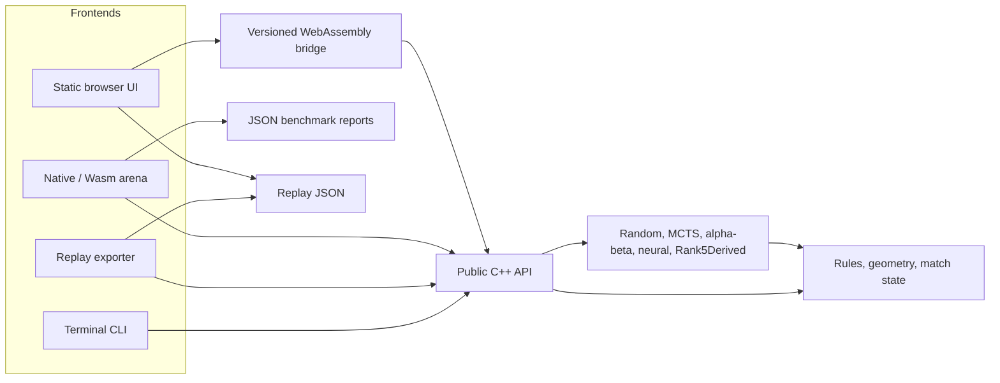

# Architecture

Paper Soccer Strategy Engine keeps one C++20 rules model behind every frontend.
The CLI, arena, replay exporter, and browser session layer all operate on the
same `GameState`, geometry, move-validation, and bot APIs. This avoids a common
failure mode in game-AI projects: benchmarking one implementation while users
play against another.

## System flow



The arrows describe dependencies, not separate rule implementations. Browser
JavaScript schedules commands, renders snapshots, and handles interaction; C++
owns legal moves, rebounds, terminal detection, bot state, and replay history.

## Public API and authoritative state

Stable public headers live in `include/papersoccer/`:

| Header | Responsibility |
| --- | --- |
| `types.hpp` | Players, points, segments, rules configuration, and `GameState` |
| `geometry.hpp` | Board topology and goal/boundary helpers |
| `rules.hpp` | Initial state, legal moves, transitions, and winner detection |
| `match.hpp` | Stateful play and move history |
| `bot.hpp` | Bot interface, configurations, factories, and search diagnostics |
| `arena.hpp` | Paired-match and shared-position report entrypoints |
| `web_game.hpp` | Versioned browser sessions, commands, and snapshots |
| `debug.hpp` | Text rendering used by native tools |

`GameState` is intentionally straightforward: it stores the rules contract,
ball position, player to move, game status, full path, used undirected
segments, and visit counts. Public rules functions remain the source of truth
for games and replays. Search-heavy bots use a compact private position with
indexed edges, bitsets, precomputed adjacency, and make/unmake operations, but
they enter and leave through the public state model.

## Core and bot boundaries

`papersoccer_core` contains the rules engine, match support, bots, and web-game
session implementation. Native executables link it directly:

- `papersoccer_cli` provides interactive human and bot play.
- `papersoccer_replay_export` writes seeded replay JSON.
- `papersoccer_arena` adds deterministic paired-match and position reports
  through `papersoccer_arena_support`.
- `papersoccer_tests` exercises the same core API used by those frontends.

All bots implement `Bot::choose_move(const GameState&)`. Stateful bots can
retain search work, but a caller always supplies the state against which the
next edge must be legal. Search statistics are exposed as typed structures;
the arena and browser serialize them without changing the decision logic.

The search implementations share compact topology and move machinery where it
is safe to do so. They do not replace the public rules engine. This division
keeps performance-sensitive recursion private while allowing rule-parity,
state-restoration, and legal-move tests to compare it against the authoritative
API.

## Browser boundary

The browser is a static site under `web/`. `src/web/web_game.cpp` owns live-game
and bot-replay sessions. `src/web/wasm_bridge.cpp` exposes a small, versioned C
ABI compiled by Emscripten. The JavaScript client sends commands and receives
complete JSON snapshots; it does not calculate game legality.

The checked-in `web/papersoccer-wasm.js` is a single-file module so the demo can
be opened directly and deployed as static files. Its fixed 32 MiB initial heap
has room for search profiles used by the demo, including a Rank5Derived-versus-
MCTS replay session. Memory growth is disabled because growable Wasm buffers
are not compatible with every direct-file browser. See
[Reproducibility](reproducibility.md#webassembly-artifact) for the pinned build
and freshness check.

The benchmark overview is a separate direct-file-compatible static page at
`web/benchmarks/index.html`. It reads the compact checked-in
`benchmark-results.js` snapshot and loads neither the game client nor the Wasm
module. The snapshot contains public bot-performance results only; its source
and freshness workflow are documented in
[Reproducibility](reproducibility.md#benchmark-website-snapshot).

Undo is a frontend command, not a mutation hidden inside a bot. Restoring a
state and asking a bot to continue can invalidate retained work. The browser
therefore pauses after undoing a bot edge and requires an explicit **Continue
bot** action. Deterministic fixed-work profiles reproduce a choice from the
same state; random or stateful searches may legitimately take a different
path after a takeback.

## Rank5Derived integration boundary

The authentic CodinGame artifact and the browser opponent are deliberately
separate concepts:

- `submissions/codingame/bots/rank_5/` contains the verified contest source,
  generated submission, replay book, value model, and historical arena record.
- `src/bots/rank5_derived/rank5_derived.cpp` includes the maintained contest
  search behind a private no-main adapter, then invokes `CompleteTurnSearch`
  under the demo's different rules and fixed-work limits.

The adapter validates a complete possession action, returns one edge through
the public bot interface, and caches later rebound edges only while the next
supplied `GameState` exactly matches the predicted state. Undo or any unrelated
input clears that continuation. Contest clock handling and exact-history replay
corrections are never entered by the adapter.

Consequently, `Rank5DerivedBot` is not the ranked entrant. Its measurements
describe the 50k-node demo profile only. The original rank 5/206 result belongs
exclusively to the generated CodinGame submission. See
[Algorithms](algorithms.md#rank5derivedbot) for the configuration differences
and [Experiments](experiments.md#rank5derived-demo-gates) for demo-only gates.

## Repository layout

```text
.
├── include/papersoccer/        Stable public C++ API
├── src/
│   ├── core/                   Rules, geometry, matches, and debug rendering
│   ├── bots/
│   │   ├── random/             Seeded RandomBot
│   │   ├── mcts/               MCTS and tactical proof search
│   │   ├── alpha_beta/         Possession-aware alpha-beta
│   │   ├── jacek_inspired/     Features, neural inference, and search adapter
│   │   └── rank5_derived/      Fixed-work adapter over maintained search
│   ├── arena/                  Runner, stable JSON report, and CLI
│   ├── cli/                    Interactive terminal frontend
│   ├── replay/                 Seeded replay exporter
│   └── web/                    C++ browser sessions and Wasm bridge
├── web/                        Static game/benchmark UIs and checked-in Wasm
├── tests/
│   ├── core/                   Rule and match behavior
│   ├── bots/                   Bot correctness and determinism
│   ├── arena/                  API and CLI report tests
│   ├── web/                    Session, JavaScript, UI, and Wasm tests
│   └── fixtures/               Frozen regression paths
├── models/                     Trained model JSON and detailed provenance
├── tools/                      Corpus, training, and gate helpers
├── submissions/codingame/      Contest bots, generators, and evidence
├── benchmarks/                 Curated compact benchmark reports and probes
├── results/                    Ignored raw local experiment output
└── CMakeLists.txt              Targets and test registration
```

Further reading:

- [Algorithms](algorithms.md)
- [Demo and replays](demo-and-replays.md)
- [Experiments](experiments.md)
- [Reproducibility](reproducibility.md)
- [CodinGame submission archive](../submissions/codingame/README.md)
- [Jacek-inspired model provenance](../models/README.md)
