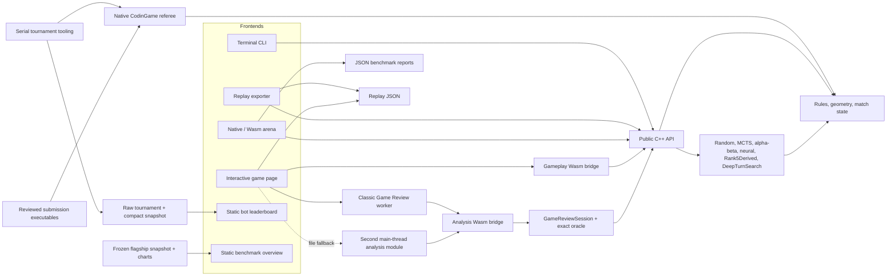

# Architecture

Paper Soccer Strategy Engine keeps one C++20 rules model behind every frontend.
The CLI, arena, replay exporter, native CodinGame referee, and browser session
layer all operate on the same `GameState`, geometry, move-validation, and bot
APIs. This avoids a common failure mode in strategy-engine projects: benchmarking one
implementation while users play against another.

## System flow



The arrows describe dependencies, not separate rule implementations. Browser
JavaScript schedules commands, renders snapshots, and handles interaction; C++
owns legal moves, rebounds, terminal detection, bot state, and replay history.
The leaderboard and benchmark overview are separate static publication
surfaces: matches and analysis run offline, and those pages only render
checked-in results.

## Public API and authoritative state

Stable public headers live in `include/papersoccer/`:

| Header | Responsibility |
| --- | --- |
| `types.hpp` | Players, points, segments, rules configuration, and `GameState` |
| `geometry.hpp` | Board topology and goal/boundary helpers |
| `rules.hpp` | Initial state, legal moves, transitions, and winner detection |
| `match.hpp` | Stateful play and move history |
| `bot.hpp` | Bot interface, configurations, factories, and search diagnostics |
| `game_review.hpp` | Complete-turn analysis, exact endgame proofs, possession grading, review sessions, and DeepTurnSearch |
| `arena.hpp` | Paired-match and shared-position report entrypoints |
| `codingame_referee.hpp` | Standalone-submission process contract and transcript validation |
| `web_game.hpp` | Versioned browser sessions, commands, and snapshots |
| `debug.hpp` | Text rendering used by native tools |

`GameState` is intentionally straightforward: it stores the rules contract,
ball position, player to move, game status, full path, used undirected
segments, and visit counts. Public rules functions remain the source of truth
for games and replays. Search-heavy bots use a compact private position with
indexed edges, bitsets, precomputed adjacency, and make/unmake operations, but
they enter and leave through the public state model.

## Core and bot boundaries

`papersoccer_core` contains the rules engine, match support, bots,
complete-turn analysis, exact endgame solver, review sessions, and web-game
session implementation. Native executables link it directly:

- `papersoccer_cli` provides interactive human and bot play.
- `papersoccer_replay_export` writes seeded replay JSON.
- `papersoccer_arena` adds deterministic paired-match and position reports
  through `papersoccer_arena_support`.
- `papersoccer_codingame_referee` runs one protocol-faithful match between two
  reviewed standalone CodinGame submissions.
- `papersoccer_tests` exercises the same core API used by those frontends.

All bots implement `Bot::choose_move(const GameState&)`. Stateful bots can
retain search work, but a caller always supplies the state against which the
next edge must be legal. Search statistics are exposed as typed structures;
the arena and browser serialize them without changing the decision logic.

The search implementations share compact topology and move machinery where it
is safe to do so. They do not replace the public rules engine. This division
keeps performance-sensitive recursion private while allowing rule-parity,
state-restoration, and legal-move tests to compare it against the authoritative
API.

## CodinGame referee and leaderboard boundaries

The canonical current local snapshot associated with the platform result is
`rank_4`; `rank_5` is its immutable predecessor and remains the source of the
separately named Rank5Derived demo adapter. The offline leaderboard includes
both along with the other reviewed artifacts and does not reinterpret any
historical platform rank.

The CodinGame leaderboard deliberately exercises the generated standalone
submissions rather than adapting their search code to the arena API. For each
game, the native referee starts two fresh persistent processes, sends each
player ID once, and then exchanges the standard complete-turn protocol. The
referee configures the authoritative engine with own goals allowed and a loss
for a player who becomes blocked. It gives each process 1,000 ms for its first
decision and 200 ms for every later decision.

Each nonempty digit response is validated as one atomic action before any edge
is committed. The action must include every mandatory rebound and stop exactly
when possession changes or the game ends. A timeout, crash, empty or malformed
response, illegal or reused edge, incomplete rebound, extra edge after a
handoff or terminal state, or bounded-output overflow is a scored forfeit. A
referee or process-launch failure is infrastructure failure and aborts the
tournament; it is never converted into a bot loss. Complete action transcripts,
decision timings, outcomes, failure classifications, artifact identities, and
runtime provenance are retained in the raw match records.

Only entries in `benchmarks/codingame_leaderboard/roster.json` are runnable.
The manifest covers all 22 CMake-registered submission directories and stores
each entrant's generated-source SHA-256 and documentation link. Every directory
maps to its own entrant. The runner invokes resolved executables directly with
a clean environment and temporary working directory, bounds captured output,
and cleans up the entire child process group. There is no browser upload,
arbitrary command, or server-side execution interface.

The frozen publication consists of 990 serial games: two complete
color-swapped round robins followed by three seeded color-swapped
perfect-matching rounds. SplitMix64 seed `20260813` fixes the recorded rating
order. Every entrant plays 90 games, exactly 45 as each player, and four or six
games against each opponent. Decisive results, including forfeits, update a
classic 1v1 TrueSkill model with the committed parameters. Standings use the
full-precision conservative estimate `mu - 3 sigma`, with canonical ID only as
an exact-score tie-breaker.

This is a transparent local approximation of the public description of
CodinGame ranking, not a reproduction of private platform matchmaking. Both
the artifact and UI therefore call the value **Local CodinGame-style score**.
The full tournament artifact remains under `benchmarks/`; a deterministic
publisher derives the smaller `web/leaderboard/leaderboard-results.js`. The
website contains standings and pairwise summaries but no transcripts, process
logs, gameplay Wasm, backend, or runtime network dependency. See
[Reproducibility](reproducibility.md#codingame-rules-bot-leaderboard) for the
refresh and freshness workflow.

## Browser and analysis boundaries

The browser is a static site under `web/`. `src/web/web_game.cpp` owns live-game
and bot-replay sessions. `src/web/wasm_bridge.cpp` exposes a small, versioned C
ABI compiled by Emscripten. The JavaScript client sends commands and receives
complete JSON snapshots; it does not calculate game legality.

The checked-in `web/papersoccer-wasm.js` is a single-file module so the demo can
be opened directly and deployed as static files. Its fixed 32 MiB initial heap
has room for search profiles used by the demo, including a Rank5Derived-versus-
MCTS replay session. Memory growth is disabled because growable Wasm buffers
are not compatible with every direct-file browser. See
[Reproducibility](reproducibility.md#webassembly-artifacts) for the pinned build
and freshness check.

Post-game analysis is deliberately isolated from live play.
`src/web/review_wasm_bridge.cpp` compiles to the lazy-loaded
`web/papersoccer-analysis-wasm.js`, with its own Wasm instance, a fixed 64 MiB
initial heap, and memory growth disabled. On hosted pages a classic
`game-review-worker.js` owns that instance. The worker receives a source replay,
lets C++ validate every declared edge and outcome, and performs one synchronous
possession step at a time. It cannot provide hints to an active gameplay
session.

Some browsers do not allow a worker to import local scripts from `file://`.
When worker creation or module loading fails there, the client creates a second
analysis module on the main thread and schedules one `GameReviewSession::step`
per event-loop task. This preserves direct-file support without sharing the
gameplay instance. Cancellation is observed between synchronous searches, so
an in-flight search may finish before cancellation takes effect. Monotonic
session IDs cause late worker or fallback results to be ignored.

The maintained review lifecycle C ABI is intentionally small:

- `ps_review_start`
- `ps_review_append_move`
- `ps_review_finalize`
- `ps_review_step`
- `ps_review_snapshot_json`
- `ps_review_cancel`
- `ps_review_last_error`

The authoritative try-line extension adds `ps_review_sandbox_start`,
`ps_review_sandbox_play`, `ps_review_sandbox_snapshot_json`, and
`ps_review_sandbox_close`. It reconstructs a new C++ `Match` at the selected
possession boundary and validates the recommended complete action on a separate
reversible state. The sandbox itself remains at the boundary and accepts only
authoritative legal continuations, so the user can follow or deviate from the
ghost recommendation. It never mutates the validation match or source replay.

The append and finalize calls include replay-declared player, source point,
rebound, status, winner, and truncation data. The bridge checks them against
the authoritative `Match`; JavaScript normalization is not accepted as proof
that an import is legal. The JSON snapshot carries analyzer, search profile,
calibration, oracle, and ranked-source identities along with complete played
and recommended possessions. Each possession also has an explicit
`confidenceState`: `exact`, `deterministic-estimate`, `borderline-estimate`, or
`unclear`. The client adds the unchanged source replay and its SHA-256 when
exporting `papersoccer.game-review.v1` and recursively removes wall-clock fields
from the deterministic artifact.

The benchmark overview is a separate direct-file-compatible static page at
`web/benchmarks/index.html`. It reads the compact checked-in
`benchmark-results.js` snapshot and loads neither the game client nor the Wasm
module. The snapshot contains public bot-performance results only; its source
and freshness workflow are documented in
[Reproducibility](reproducibility.md#benchmark-website-snapshot).

The bot leaderboard follows the same static boundary at
`web/leaderboard/index.html`. Its classic script reads the compact checked-in
`leaderboard-results.js` snapshot. The bulky match transcripts and runtime
logs remain in the canonical raw artifact and are not shipped as page data.

Undo is a frontend command, not a mutation hidden inside a bot. Restoring a
state and asking a bot to continue can invalidate retained work. The browser
therefore pauses after undoing a bot edge and requires an explicit **Continue
bot** action. Deterministic fixed-work profiles reproduce a choice from the
same state; random or stateful searches may legitimately take a different
path after a takeback.

## Rank5Derived integration boundary

The historical `rank_5` CodinGame artifact and the browser opponent are
deliberately separate concepts:

- `submissions/codingame/bots/rank_5/` contains the verified contest source,
  generated submission, replay book, value model, and historical arena record.
- `src/bots/rank5_derived/rank5_derived.cpp` is the only engine translation
  unit that includes the immutable historical contest source. Its private
  opaque adapter invokes the immutable `CompleteTurnSearch` without copying or
  changing the ranked source.
- Public `CompleteTurnAnalyzer` and `DeepTurnSearchBot` types reuse that opaque
  adapter under separately named analysis profiles. Configurable analysis can
  never identify itself as `Rank5DerivedBot`.

The adapter validates a complete possession action, returns one edge through
the public bot interface, and caches later rebound edges only while the next
supplied `GameState` exactly matches the predicted state. Undo or any unrelated
input clears that continuation. Contest clock handling and exact-history replay
corrections are never entered by the adapter.

`Rank5DerivedBot` has no configurable constructor. Its identity means exactly
depth 32, 50,000 nodes, 65,536 transposition entries, 32,768 evaluation-cache
entries, no wall clock, no replay corrections, and a 0% learned-value blend.
Consequently it is not the ranked entrant, and its measurements describe that
fixed demo profile only. `DeepTurnSearchBot` uses one of the separately named
100k, 200k, or 400k profiles and caches later rebound edges only while the
supplied state matches its predicted continuation. The original rank 5/206
result belongs exclusively to the generated CodinGame submission. See
[Algorithms](algorithms.md#rank5derivedbot) for the configuration differences
and [Experiments](experiments.md#rank5derived-demo-gates) for demo-only gates.

## Repository layout

```text
.
├── include/papersoccer/        Stable public C++ API
├── src/
│   ├── core/                   Rules, geometry, matches, and debug rendering
│   ├── bots/
│   │   ├── random/             Seeded RandomBot
│   │   ├── mcts/               MCTS and tactical proof search
│   │   ├── alpha_beta/         Possession-aware alpha-beta
│   │   ├── jacek_inspired/     Features, neural inference, and search adapter
│   │   └── rank5_derived/      Fixed-work adapter over immutable rank-5 search
│   ├── analysis/               Complete-turn review and exact endgame solver
│   ├── arena/                  Runner, stable JSON report, and CLI
│   ├── codingame/              Native process referee and protocol validation
│   ├── cli/                    Interactive terminal frontend
│   ├── opening_bank/           Replay-checked benchmark opening support
│   ├── replay/                 Seeded replay exporter
│   └── web/                    C++ browser sessions and two Wasm bridges
├── web/                        Static UIs, worker, clients, and checked-in Wasm
├── tests/
│   ├── analysis/               Solver, possession, grading, and review tests
│   ├── core/                   Rule and match behavior
│   ├── bots/                   Bot correctness and determinism
│   ├── arena/                  API and CLI report tests
│   ├── codingame/              Submission, promotion, and referee tests
│   ├── codingame_leaderboard/  Roster, schedule, rating, and publishing tests
│   ├── flagship_study/         Frozen-study analysis and packaging tests
│   ├── opening_bank/           Opening generation and replay validation
│   ├── web/                    Session, JavaScript, UI, and Wasm tests
│   ├── game_review_gate/       Frozen gate integrity and statistics tests
│   └── fixtures/               Frozen regression paths
├── models/                     Trained model JSON and detailed provenance
├── tools/                      Corpus, training, and gate helpers
├── submissions/codingame/      Contest bots, generators, and evidence
├── benchmarks/                 Curated compact benchmark reports and probes
├── results/                    Ignored raw output plus curated campaign evidence
└── CMakeLists.txt              Targets and test registration
```

Further reading:

- [Algorithms](algorithms.md)
- [Demo and replays](demo-and-replays.md)
- [Experiments](experiments.md)
- [Reproducibility](reproducibility.md)
- [CodinGame submission archive](../submissions/codingame/README.md)
- [Model artifacts and provenance](../models/README.md)
