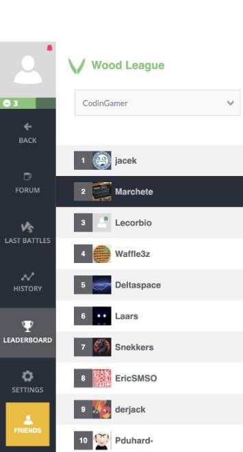

# Paper Soccer rank-three snapshot

This immutable, self-contained C++ source reached rank **3 of 211** on
2026-09-27 after completed CodinGame calibration, with score **43.36**.
Agent: `6764344`; submission: `41384976`. All 90 games were archived:
79 clean rule-terminal games, 11 opponent operational failures, and zero
bot-attributable operational failures.

Fresh confirmation passed on 700 fresh roots screened against prior exposure
(2,800 games): **+19.07 percentage points** against the retained control,
95% root-cluster bootstrap interval **+16.21 to +21.93 points**, with zero
operational failures. All seven opponent strata improved. The candidate won
1,024/1,400 games; the control won 757/1,400.

A fresh live check at 08:31 UTC on 2026-09-27 still showed rank **3/211**.
The editor matched the released bytes, and the latest 90 game IDs matched the
archived completed-calibration window; no later games were present.

Paste `submission.cpp` directly into the C++ editor. It is 99,032 ASCII
characters, below the 100,000-character limit. Its SHA-256 is:

```
78e731a81ce7cc702a200d0832a6c75e967a11b12452051724ab1387c226e4b8
```

The bot uses the corrected proof-ranking evaluator, a quantized evaluator with 6,301 inputs, hidden
layers of 12 and 8 units, and four-bit weights, within complete-turn search. It adds the exact
flat goal-distance traversal and uses 550 ms for its first decision and
140 ms thereafter. Heuristic values remain separate from terminal proofs.

Build from the repository root with a C++20 compiler:

```sh
mkdir -p build/codingame
clang++ -std=c++20 -O3 -DNDEBUG \
  submissions/codingame/releases/20260927-rank3/submission.cpp \
  -o build/codingame/rank3
```

The qualification build used Apple clang 21.0.0. This release is outside the
maintained `bots/` concatenation workflow: changing formatting or regenerating
it would change the exact source identity. Preserve the published bytes.

Development covered 224 paired roots and 2,240 games across five arms. This
source improved by 16.52 percentage points over the retained Rank-4 control,
with no operational failures. Its direct contrast with the corrected parent
was neutral (95% interval −4.02 to +4.02 points); the whole gain must not be
attributed to traversal alone. A fixed twelve-game private platform panel
finished 7–5 with no operational failures. That panel is descriptive, not an
independent strength estimate.

Source binding uses an independent editor copyback, one arena activation, and
public agent/submission identities. The platform does not expose a remote
source digest. Completed calibration and later rankings are distinct records.

See [the experiment report](REPORT.md), [paired confirmation results](confirmation.json),
[completed live evidence](live-calibration.json), and [final live check](current-status.json).


